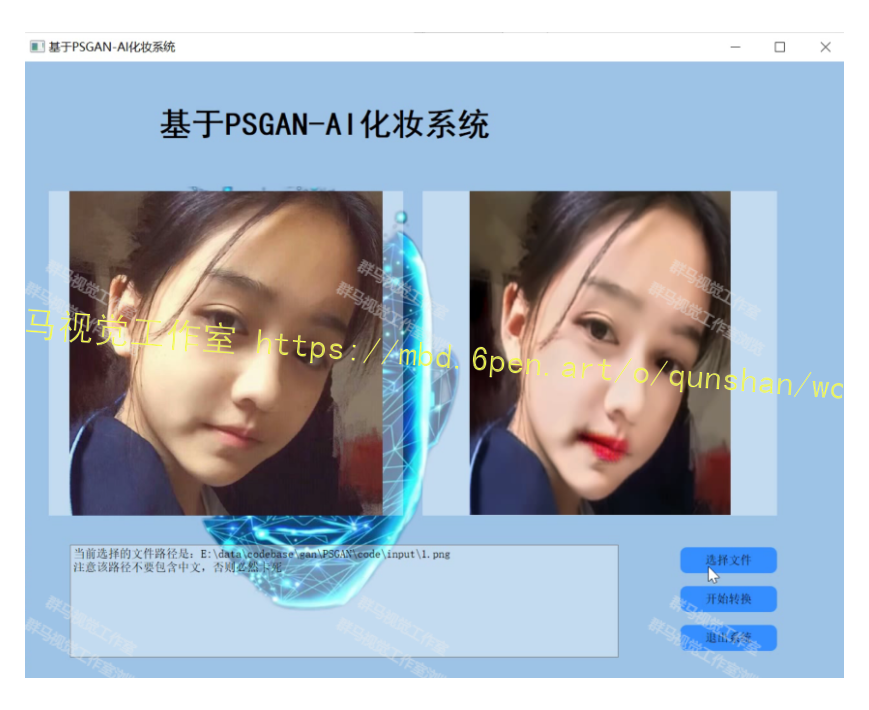
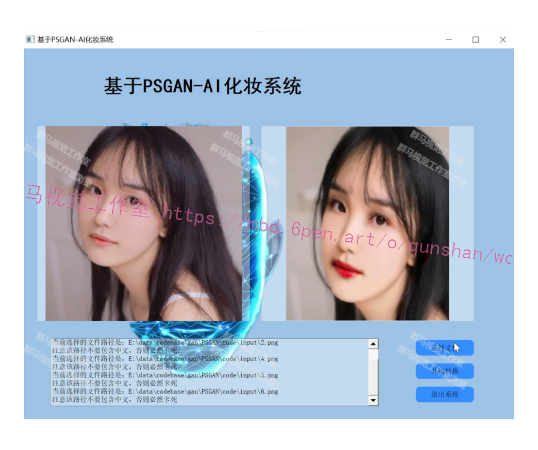
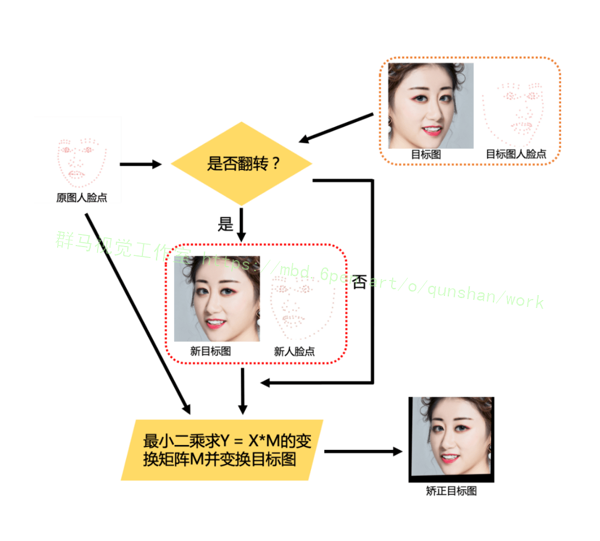
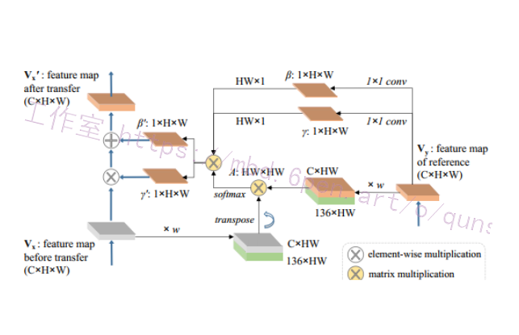
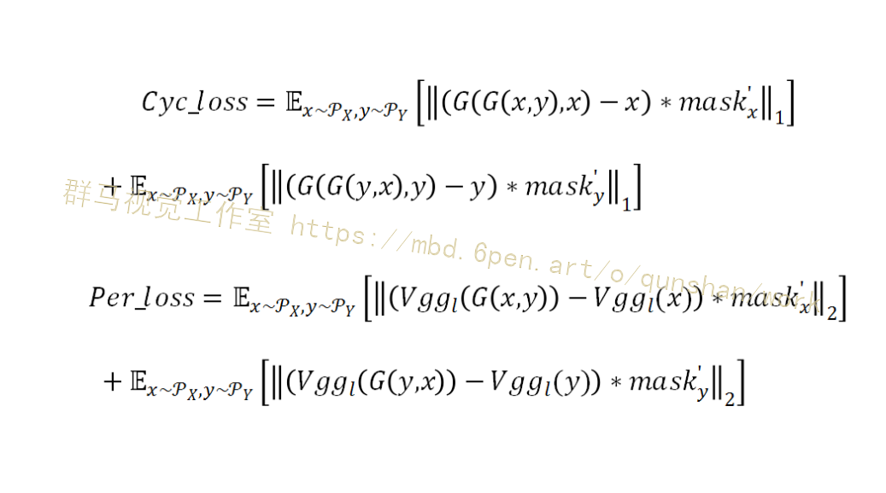
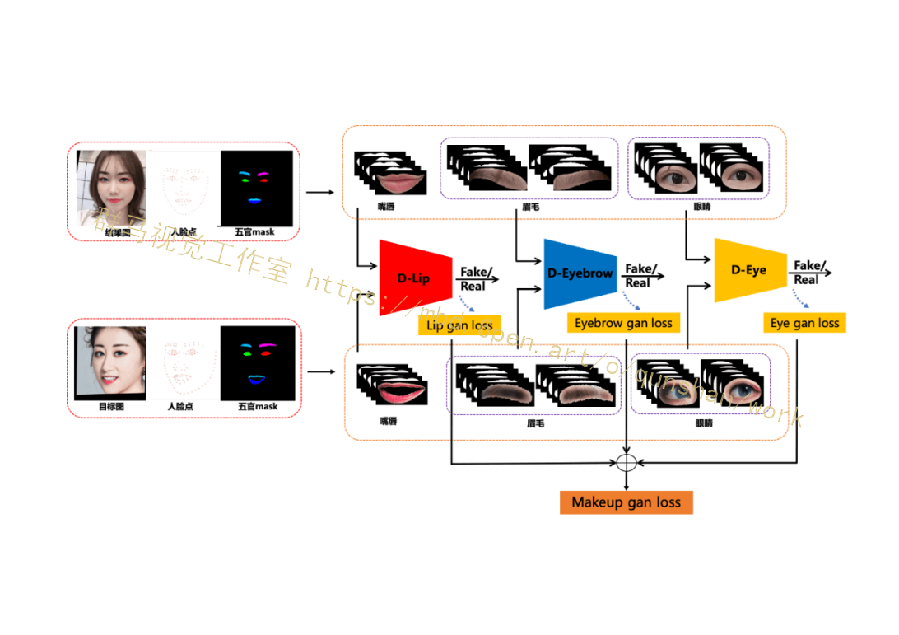
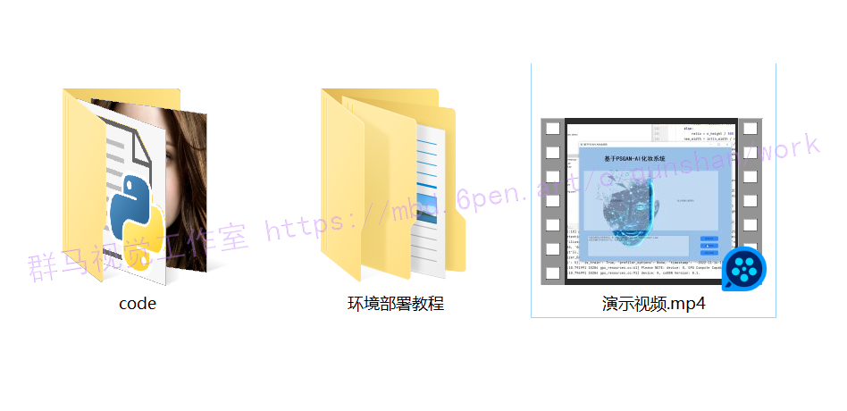

# 1.研究背景
在计算机视觉领域，基于人脸图像的合成与分析一直是热门的研究课题。人脸表情合成在影视娱乐、人工智能产业应用广泛，自动化妆技术在美妆行业有着巨大的应用前景。虽然人脸图像合成技术在近几年得到了较大的发展，但在表情迁移与妆容迁移方面，仍存在难点与挑战：人脸表情因人而异，是面部肌肉与纹理共同变化的结果，要在保留原始身份的前提下自然清晰地模拟表情的变化并不容易；妆容风格更是千变万化，没有规律可循，同时还受到年龄、种族的影响。因此，在人脸表情迁移与妆容迁移的研究上仍需探索与创新。

# 2.图片演示

# 3.视频演示
[基于改进PSGAN的AI自动美颜化妆系统（源码＆教程）_哔哩哔哩_bilibili](https://www.bilibili.com/video/BV13d4y1c7Km/?spm_id_from=333.999.0.0&vd_source=bc9aec86d164b67a7004b996143742dc)

# 4.妆容迁移技术研究现状
妆容迁移是指将目标图上的妆容直接迁移到原图上的技术。相比传统贴妆技术，妆容迁移具有极高的自由度，它可以让用户不再局限于设计师设计好的妆容，而是可以自主、任意地从真实模特图中获取妆容，极大地丰富了妆容的多样性。

此外，妆容迁移技术不仅可以迁移五官妆容信息，还可以对肤色、光影等信息进行整体迁移。再加上妆容信息直接来源于真实模特图，因此该技术可以很好地保持妆容的真实度。

但妆容迁移属于目前较新的研究领域，相比于其他 DL 研究任务，需要解决以下两个主要问题：

一是原图和目标图五官位置和姿态都不固定，如何让网络感知不同位置上的妆容信息？
二是该任务很难获取真实环境中的一对一数据，如何让网络正确监督学习？
对于这两个问题，近些年的一些研究者提出了一些解决方案，具体可以总结如下：

对于问题 1，主要采用的解决办法是：设计一种映射和反映射机制（也可以设计网络结构来实现这样的映射），将原图像特征映射为 identity feature 和 makeup feature，这样原图的 identity feature 可以和目标图的 makeup feature 进行组合，将组合特征反映射为图像特征就可以显式地让网络更好地感知妆容信息；

对于问题 2，主要采用的解决办法有两类：a，用一种颜色迁移算法（比如直方图匹配）结合五官分割进行局部颜色迁移，把目标图各五官成分的颜色迁移到原图对应的五官成分上，这样网络输出的五官区域就可以和颜色迁移后的五官区域直接做 loss 进行学习；b，结合人脸点用一种形变算法（比如三角网格形变）将目标图 warp 到原图上，这样原图和目标图的五官就基本对齐了，再设计 loss 进行监督训练。

研究者们的创新方案收获了很多成果。目前，对于原图和目标图姿态比较接近且肤色差异较小的情况下，[参考该博客提出的方案能比较好地迁移五官妆容的颜色信息](https://mbd.pub/o/bread/Y5yTlpdu)。

然而，对于真实用户复杂多变的环境（复杂姿态、复杂光照、复杂妆容等）以及更多细腻细节的迁移需求（睫毛、眼瞳、亮片闪片等），妆容迁移技术依然面临着很大挑战。

# 5.算法流程图
（1）通过 MTlab 自主研发的人脸关键点检测算法检测出原始尺寸的原图和目标图的人脸点，并做摆正、裁脸等操作得到流程图中以及后续步骤提到的原图、目标图、原图人脸点和目标图人脸点；
（2）通过 MTlab 自主研发的五官分割算法将原图和目标图的眉毛、眼睛、嘴唇和皮肤分割出来作为后续模块的输入；
（3）将目标图、原图人脸点和目标图人脸点输入姿态矫正模块，并得到姿态矫正后的目标图，姿态矫正后的目标图整体上会和原图的姿态一致，并且整个脸的五官大小比例会更接近原图；
（4）把矫正后的目标图和原图输入 G 网络得到结果图，根据结果图和目标图计算 Cycle consistency loss、Perceptual loss 和 Makeup loss，同时把结果图、原图人脸点、原图五官 mask 输入 MakeupGan 模块计算 Makeup gan loss，这些 loss 控制整个网络的训练；
（5）将实际裁好后的图输入训练好的 G 网络可以得到网络输出的结果图，结合 MTlab 自研的颜色迁移算法将原图的颜色和光照迁回一部分到结果图上确保结果更加自然，并将处理后的结果图逆回到原始尺寸原图中即完成算法过程。

# 6.PSGAN算法
#### 主要贡献：

（1）PSGAN是第一个实现局部换妆，换妆深浅控制，姿态，表情鲁棒的换妆算法，可以很好的应用于真实世界环境。
（2）PSGAN中的MDNet模块被提出，从参考图片中分解出妆容信息为2个矩阵，通过这2个矩阵实现局部换妆，换妆深浅控制。
（3）PSGAN中的AMM模块，实现将妆容信息的2个矩阵过渡为对应于原图的2个矩阵。
提出新的换妆数据集Makeup-Wild dataset

#### 整体模块组成

Makeup distill network（MDNet）
MDNet实现了从参考图片中提取出参考图片的妆容信息，将这些妆容信息表示为2个妆容矩阵γ，β，其矩阵维度大小为1*H*W 。
由于原始图片和参考图片可能会在表情和姿态上存在大的差异，因此MDNet直接提取的妆容矩阵γ，β不可以被直接应用于原始图片。这里通过原图和参考图生成的attention矩阵，将妆容矩阵γ，β修改为适应于原图的妆容矩阵γ’，β’。
实现上首先对参考图的维度进行变换，将C*H*W的维度变换为C*(HW)，然后在channel维度上concat一个人脸68个关键点坐标位置矩阵。对原始图片也进行该同样的操作。然后将原始图片的(C+136)*HW和参考图片的(C+136)*HW进行矩阵运算，得到attention矩阵HW*HW。
这里还需要对P进行一个归一化操作，同时，除了位置信息之外，还需要加入该位置的像素信息V，最终将该attention矩阵表示如下：

# 7.改进PSGAN模块
#### 姿态矫正模块
对于 G 网络结构、Makeup loss、Cycle consistency loss 和 Perceptual loss，[该方案参考该博客提出的方案并进行调整](https://afdian.net/item?plan_id=8e43a76863f311ed9a0952540025c377)。由于 MakeupGan 方案设计了姿态矫正模块，已经可以较好地进行显式的姿态适配，因此在 G 网络中删除了论文里的 AMM 结构。Makeup loss 则沿用了 PSGan 的局部五官直方图匹配 loss。

由于 Cycle consistency loss 和 Perceptual loss 里的 input 和 target 使用的是同一张图，这在一定程度上会削弱其它 loss 对于五官区域的监督，进而影响妆容的学习。MTlab 利用五官 mask 来调节这一问题。首先对五官 mask 取反并进行边缘模糊，然后再把模糊后的 mask 归一化到 (a,1](a>0) 之间得到 mask’。利用 mask’将 loss 调整如下：

#### Makeup 模块

该模块是本方案的核心创新模块，主要保证美瞳、卧蚕、亮片闪片等妆容细节的迁移。MakeupGan 模块设计了 3 个 D 网络，分别是眉毛判别网络 D-Eyebrow、眼睛判别网络 D-Eye 和嘴唇判别网络 D-Lip。

D 网络结构的设计主要参考了论文 [2] 采用 SFT 结构，并把 G 网络改成 D 网络来使用。具体所做的调整为：（1）把 residual blocks 的数量从 16 调整为 8；（2）去掉 Upsampling 之后的层。此外，Condition 网络部分使用 4 通道的局部五官 mask 作为输入，4 通道的 mask 包括：原 mask、对原 mask 进行左右翻转后的 mask、对原 mask 进行向左镜像后的 mask、对原 mask 进行向右镜像后的 mask，而 Condition 网络的输出即为 SFT 的 Condition maps 部分。

眉毛和眼睛都有左右之分，训练时会将左右两部分 concat 起来，所以 D-eyebrow 和 D-eye 的 D 网络部分为 6 通道输入，Condition 网络部分为 8 通道输入，而 D-lip 的 D 网络部分为 3 通道输入，Condition 网络部分为 4 通道输入。

要训练 D 网络并获得 Makeup loss 需要从结果图和目标图中获取各自的五官成分，借助人脸点即可 crop 出每个五官的矩形框，再用 mask 把非五官区域与掉就得到五官成分。每个 D 网络可以得到一个 gan loss，这样就可以得到 3 个 gan loss，即 Eyebrow gan loss、Eye gan loss 和 Lip gan loss。把 3 个 loss 加起来就是本方案的 Makeup loss。

# 8.系统整合

下图[完整源码＆环境部署视频教程＆自定义UI界面](https://s.xiaocichang.com/s/2df60d)

参考博客[《基于改进PSGAN的AI自动美颜化妆系统（源码＆教程）》](https://mbd.pub/o/qunma/work)

# 9.参考文献
***
[1][王万良](https://s.wanfangdata.com.cn/paper?q=%E4%BD%9C%E8%80%85:%22%E7%8E%8B%E4%B8%87%E8%89%AF%22),[李卓蓉](https://s.wanfangdata.com.cn/paper?q=%E4%BD%9C%E8%80%85:%22%E6%9D%8E%E5%8D%93%E8%93%89%22).[生成式对抗网络研究进展](https://d.wanfangdata.com.cn/periodical/txxb201802014)[J].[通信学报](https://sns.wanfangdata.com.cn/perio/txxb).2018,(2).DOI:[10.11959/j.issn.1000-436x.2018032](http://dx.chinadoi.cn/10.11959/j.issn.1000-436x.2018032).

[2][曹宁哲](https://s.wanfangdata.com.cn/paper?q=%E4%BD%9C%E8%80%85:%22%E6%9B%B9%E5%AE%81%E5%93%B2%22),[侯进](https://s.wanfangdata.com.cn/paper?q=%E4%BD%9C%E8%80%85:%22%E4%BE%AF%E8%BF%9B%22),[马文超](https://s.wanfangdata.com.cn/paper?q=%E4%BD%9C%E8%80%85:%22%E9%A9%AC%E6%96%87%E8%B6%85%22).[带眼球细节的情感虚拟人面部表情合成](https://d.wanfangdata.com.cn/periodical/jsjyyyj201612071)[J].[计算机应用研究](https://sns.wanfangdata.com.cn/perio/jsjyyyj).2016,(12).DOI:[10.3969/j.issn.1001-3695.2016.12.071](http://dx.chinadoi.cn/10.3969/j.issn.1001-3695.2016.12.071).

[3][王晓慧](https://s.wanfangdata.com.cn/paper?q=%E4%BD%9C%E8%80%85:%22%E7%8E%8B%E6%99%93%E6%85%A7%22),[贾珈](https://s.wanfangdata.com.cn/paper?q=%E4%BD%9C%E8%80%85:%22%E8%B4%BE%E7%8F%88%22),[蔡莲红](https://s.wanfangdata.com.cn/paper?q=%E4%BD%9C%E8%80%85:%22%E8%94%A1%E8%8E%B2%E7%BA%A2%22).[基于小波图像融合的表情细节合成](https://d.wanfangdata.com.cn/periodical/jsjyjyfz201302018)[J].[计算机研究与发展](https://sns.wanfangdata.com.cn/perio/jsjyjyfz).2013,(2).

[4][李海洋](https://s.wanfangdata.com.cn/paper?q=%E4%BD%9C%E8%80%85:%22%E6%9D%8E%E6%B5%B7%E6%B4%8B%22).[基于频域特征提取的人脸图像迁移方法研究](https://d.wanfangdata.com.cn/periodical/D01385710)[J].西安电子科技大学.2017.

[5][蒲倩](https://s.wanfangdata.com.cn/paper?q=%E4%BD%9C%E8%80%85:%22%E8%92%B2%E5%80%A9%22).[人脸表情迁移与分析方法研究](https://d.wanfangdata.com.cn/periodical/D551467)[J].西安电子科技大学.2014.

[6][万贤美](https://s.wanfangdata.com.cn/paper?q=%E4%BD%9C%E8%80%85:%22%E4%B8%87%E8%B4%A4%E7%BE%8E%22).[真实感人脸表情合成的关键技术研究](https://d.wanfangdata.com.cn/periodical/Y2281536)[J].浙江大学.2012.

[7][Kristina Scherbaum](https://s.wanfangdata.com.cn/paper?q=%E4%BD%9C%E8%80%85:%22Kristina%20Scherbaum%22),[Tobias Ritschel](https://s.wanfangdata.com.cn/paper?q=%E4%BD%9C%E8%80%85:%22Tobias%20Ritschel%22),[Matthias Hullin](https://s.wanfangdata.com.cn/paper?q=%E4%BD%9C%E8%80%85:%22Matthias%20Hullin%22),等.[Computer-Suggested Facial Makeup](https://d.wanfangdata.com.cn/periodical/205314c2b02c163724675bf8bbaa7c09)[J].Computer Graphics Forum: Journal of the European Association for Computer Graphics.2011,30(2).

[8][Heejin Chung](https://s.wanfangdata.com.cn/paper?q=%E4%BD%9C%E8%80%85:%22Heejin%20Chung%22),[Sung Yong Shin](https://s.wanfangdata.com.cn/paper?q=%E4%BD%9C%E8%80%85:%22Sung%20Yong%20Shin%22),[Bongcheol Park](https://s.wanfangdata.com.cn/paper?q=%E4%BD%9C%E8%80%85:%22Bongcheol%20Park%22),等.[A feature-based approach to facial expression cloning](https://d.wanfangdata.com.cn/periodical/42e75311d39476037229abc62b6077b8)[J].Computer Animation & Virtual Worlds..2005,16(3).291-303.

[9][Patrick Perez](https://s.wanfangdata.com.cn/paper?q=%E4%BD%9C%E8%80%85:%22Patrick%20Perez%22),[Michel Gangnet](https://s.wanfangdata.com.cn/paper?q=%E4%BD%9C%E8%80%85:%22Michel%20Gangnet%22),[Andrew Blake](https://s.wanfangdata.com.cn/paper?q=%E4%BD%9C%E8%80%85:%22Andrew%20Blake%22).[Poisson Image Editing](https://d.wanfangdata.com.cn/periodical/64ef96fd551997d9ddf296345345262b)[J].ACM Transactions on Graphics.2003,22(3).313-318.

[10][Danilo Jimenez Rezende](https://s.wanfangdata.com.cn/paper?q=%E4%BD%9C%E8%80%85:%22Danilo%20Jimenez%20Rezende%22),[Shakir Mohamed](https://s.wanfangdata.com.cn/paper?q=%E4%BD%9C%E8%80%85:%22Shakir%20Mohamed%22),[Daan Wierstra](https://s.wanfangdata.com.cn/paper?q=%E4%BD%9C%E8%80%85:%22Daan%20Wierstra%22).[Stochastic Backpropagation and Approximate Inference in Deep Generative Models](https://d.wanfangdata.com.cn/conference/CC0214672635)[C].2014

---
#### 如果您需要更详细的【源码和环境部署教程】，除了通过【系统整合】小节的链接获取之外，还可以通过邮箱以下途径获取:
#### 1.请先在GitHub上为该项目点赞（Star），编辑一封邮件，附上点赞的截图、项目的中文描述概述（About）以及您的用途需求，发送到我们的邮箱
#### sharecode@yeah.net
#### 2.我们收到邮件后会定期根据邮件的接收顺序将【完整源码和环境部署教程】发送到您的邮箱。
#### 【免责声明】本文来源于用户投稿，如果侵犯任何第三方的合法权益，可通过邮箱联系删除。